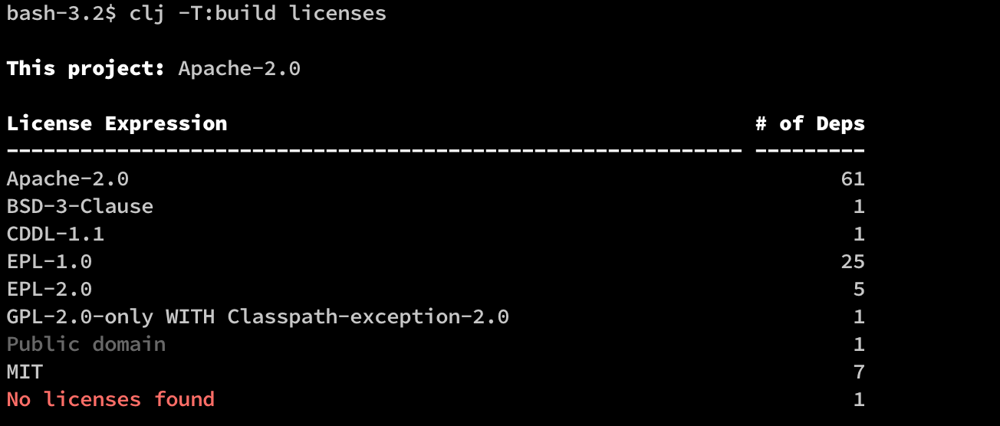
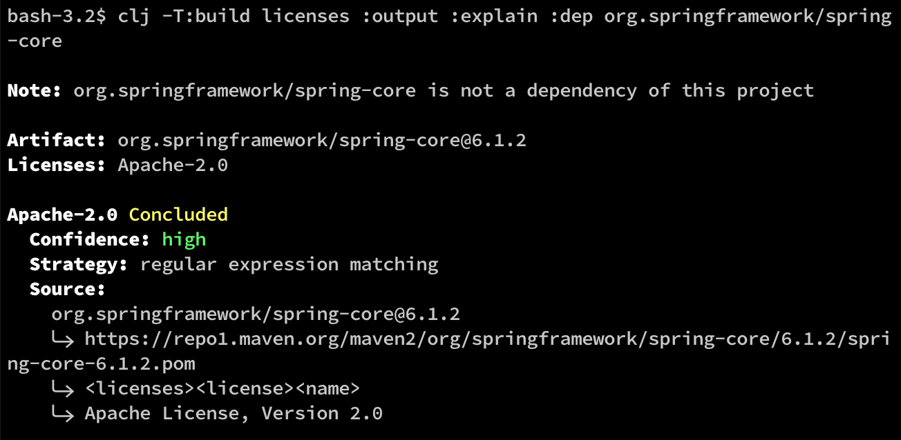
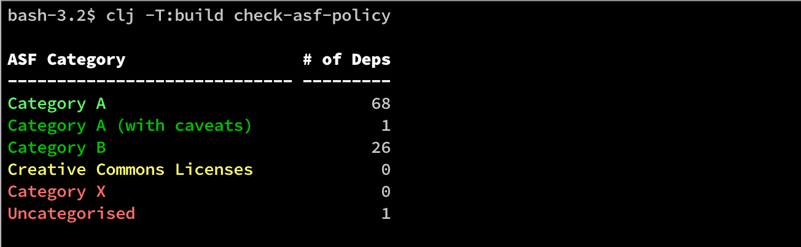

| | | |
|---:|:---:|:---:|
| [**release**](https://github.com/pmonks/tools-licenses/tree/release) | [](https://github.com/pmonks/tools-licenses/actions?query=workflow%3ACI+branch%3Arelease) | [](https://github.com/pmonks/tools-licenses/actions?query=workflow%3Adependencies+branch%3Arelease) |
| [**dev**](https://github.com/pmonks/tools-licenses/tree/dev) | [](https://github.com/pmonks/tools-licenses/actions?query=workflow%3ACI+branch%3Adev) | [](https://github.com/pmonks/tools-licenses/actions?query=workflow%3Adependencies+branch%3Adev) |

[](https://clojars.org/com.github.pmonks/tools-licenses/) [](https://github.com/pmonks/tools-licenses/blob/release/LICENSE) [](https://github.com/pmonks/tools-licenses/issues)


# tools-licenses

A Clojure [tools.build](https://github.com/clojure/tools.build) task library for interrogating your project's dependencies' licenses.  Somewhat inspired by the (discontinued) [`lein-licenses`](https://github.com/technomancy/lein-licenses/) Leiningen plugin, but with the added benefit of canonicalisation to [SPDX](https://spdx.dev/) [License Expressions](https://spdx.github.io/spdx-spec/v2.3/SPDX-license-expressions/).

It also provides the ability to check your (Apache-2.0 licensed) project against the [Apache Software Foundation's 3rd Party License Policy](https://www.apache.org/legal/resolved.html).

## Disclaimer

**The author and contributors to `tools-licenses` are not lawyers, and neither they nor `tools-licenses` itself provide legal advice. This is simply a tool that might help you and your legal counsel perform licensing due diligence on your projects.**

## System Requirements

This tool uses the [`lice-comb` library](https://github.com/pmonks/lice-comb), which has these system requirements:

* JDK 11 or higher.

* An internet connection.

* Assumes Maven is installed and in the `PATH` (but has fallback logic if it isn't available).

## Tasks

1. `licenses` - attempt to display the licenses used by all transitive dependencies of the project
2. `check-asf-policy` - attempt to check your project's probable compliance (or not) with the ASF's 3rd Party License Policy

## Why not [`tools.deps`' built-in license detection](https://clojure.org/reference/deps_and_cli#_other_programs)?

`tools.deps`' license discovery logic (provided via the command `clj -X:deps list`) has several serious shortcomings, including:

* It only scans Maven POM files for license information, and silently ignores projects that don't have license tags in their POM file, or don't have a POM file at all. This is a problem because:
  * git dependencies (whose use is encouraged by tools.deps/tools.build) don't need a POM file (and in practice most don't provide one)
  * silently ignoring projects that lack a `pom.xml` file (or have one that doesn't contain licensing information) may lull users into a false sense of security vis-a-vis license compliance
  * [Clojars only recently started mandating license information in the POM files it hosts](https://github.com/clojars/clojars-web/issues/873), and as of mid-2023 around 1/3 of all projects deployed hosted there do not include any licensing information in their POM files
* It's coupled to tools.deps and cannot easily be consumed as an independent library. It's also dependent on tools.deps state management (e.g. requires POM files to be downloaded locally).
* It doesn't canonicalise license information to SPDX License Expressions, or even (in some cases) SPDX License Identifiers.
* It only reports the first license for multi-licensed artifacts.

In contrast, `tools-licenses` leverages the [`lice-comb` library](https://github.com/pmonks/lice-comb), a build-tool-agnostic library that takes a more comprehensive approach to license detection.

## Why not [`scarletcomply/license-finder`](https://github.com/scarletcomply/license-finder)?

* It doesn't canonicalise license information to SPDX License Expressions, or even (in some cases) SPDX License Identifiers.
* It only reports the first license for multi-licensed artifacts.

## I use Leiningen - is something like `tools-licenses` available?

While Leiningen's original [`lein-licenses` plugin](https://github.com/technomancy/lein-licenses) was discontinued some years ago and finally archived in 2020, [JohnnyJayJay has developed an alternative `lein-licenses` plugin](https://github.com/JohnnyJayJay/lein-licenses/) that leverages the same underlying license detection library ([`lice-comb`](https://github.com/pmonks/lice-comb)) as `tools-licenses`, thereby offering similar capabilities.

## Usage

### Documentation

[API documentation is available here](https://pmonks.github.io/tools-licenses/), or [here on cljdoc](https://cljdoc.org/d/com.github.pmonks/tools-licenses/).

[FAQ is available here](https://github.com/pmonks/tools-licenses/wiki/FAQ).

### Adding the tasks to your tools.build script

Add the tool as a Maven dependency to your `deps.edn`, in your build alias:

```edn
  :aliases
    :build
      {:deps {com.github.pmonks/tools-licenses {:mvn/version "LATEST_CLOJARS_VERSION"}}  ; Or use "RELEASE" to blindly follow the latest release of the tool
       :ns-default your.build.ns}
```

Require the namespace in your tools.build script (typically called `build.clj`), and add task functions that delegate to the tool:

```clojure
(ns your.build.ns
  (:require [tools-licenses.tasks :as lic]))

(defn licenses
  "Attempts to list all licenses for the transitive set of dependencies of the
  project, as SPDX license expressions."
  [opts]
  (lic/licenses opts))

(defn check-asf-policy
  "Checks this project's dependencies' licenses against the ASF's 3rd party
  license policy (https://www.apache.org/legal/resolved.html).

  Note: only meaningful if this project is Apache-2.0 licensed."
  [opts]
  (lic/check-asf-policy opts))
```

Optionally, you may also wish to configure logging for your `build` alias, since this tool can emit logging output.  For example (using log4j2):

```edn
    :build
      {:deps {com.github.pmonks/tools-licenses           {:mvn/version "LATEST_CLOJARS_VERSION"}  ; Or use "RELEASE" to blindly follow the latest release of the tool
              org.apache.logging.log4j/log4j-api         {:mvn/version "2.21.1"}
              org.apache.logging.log4j/log4j-core        {:mvn/version "2.21.1"}
              org.apache.logging.log4j/log4j-jul         {:mvn/version "2.21.1"}    ; Java utils clogging bridge
              org.apache.logging.log4j/log4j-jcl         {:mvn/version "2.21.1"}    ; Apache commons clogging bridge
              org.apache.logging.log4j/log4j-slf4j2-impl {:mvn/version "2.21.1"}    ; SLF4J clogging bridge
              org.apache.logging.log4j/log4j-1.2-api     {:mvn/version "2.21.1"}}   ; log4j1 clogging bridge
       :ns-default your.build.ns}
```

Then add this `log4j2.xml` file in the root directory of your project (or another directory, which would then need to be added to the `:paths` of your build alias):

```xml
<?xml version="1.0" encoding="UTF-8"?>
<Configuration status="WARN" strict="true">
  <Properties>
    <Property name="filename">build.log</Property>
  </Properties>
  <Appenders>
    <Appender type="File" name="File" fileName="${filename}">
      <Layout type="PatternLayout" pattern="%d %p %C{1.} [%t] %m%n" />
    </Appender>
  </Appenders>
  <Loggers>
    <!-- These libraries tend to be exceptionally noisy, even at WARN -->
    <Logger name="org.apache" level="FATAL">
      <AppenderRef ref="File"/>
    </Logger>
    <Logger name="org.eclipse" level="FATAL">
      <AppenderRef ref="File"/>
    </Logger>
    <Root level="WARN">
      <AppenderRef ref="File"/>
    </Root>
  </Loggers>
</Configuration>
```

### Using the tasks from the command line

#### `licenses` task

Example summary output:



Other invocation possibilities:
* `clj -T:build licenses :output :summary` - the default (see above)
* `clj -T:build licenses :output :detailed` - detailed per-dependency license information
* `clj -T:build licenses :output :edn` - detailed per-dependency license information in EDN format
* `clj -T:build licenses :output :explain :dep <dep symbol>` - an explanation of how the tool arrived at the given license(s) for a single dep (expressed as a tools.dep symbol). For example:



If you see `Unidentified (<some text>)` licenses in the output, **[please raise an issue here](https://github.com/pmonks/lice-comb/issues/new?assignees=pmonks&labels=unknown+licenses&template=Unknown_licenses.md)**.

#### `check-asf-policy` task

Example summary output:



Other invocation possibilities:
* `clj -T:build check-asf-policy :output :summary` - the default (see above)
* `clj -T:build check-asf-policy :output :detailed` - detailed per-dependency ASF category information
* `clj -T:build check-asf-policy :output :edn` - detailed per-dependency ASF category information in EDN format

## Contributor Information

[Contributing Guidelines](https://github.com/pmonks/tools-licenses/blob/release/.github/CONTRIBUTING.md)

[Bug Tracker](https://github.com/pmonks/tools-licenses/issues)

[Code of Conduct](https://github.com/pmonks/tools-licenses/blob/release/.github/CODE_OF_CONDUCT.md)

### Developer Workflow

This project uses the [git-flow branching strategy](https://nvie.com/posts/a-successful-git-branching-model/), and the permanent branches are called `release` and `dev`.  Any changes to the `release` branch are considered a release and auto-deployed (JARs to Clojars, API docs to GitHub Pages, etc.).

For this reason, **all development must occur either in branch `dev`, or (preferably) in temporary branches off of `dev`.**  All PRs from forked repos must also be submitted against `dev`; the `release` branch is **only** updated from `dev` via PRs created by the core development team.  All other changes submitted to `release` will be rejected.

### Build Tasks

`tools-licenses` uses [`tools.build`](https://clojure.org/guides/tools_build). You can get a list of available tasks by running:

```
clojure -A:deps -T:build help/doc
```

Of particular interest are:

* `clojure -T:build test` - run the unit tests
* `clojure -T:build lint` - run the linters (clj-kondo and eastwood)
* `clojure -T:build ci` - run the full CI suite (check for outdated dependencies, run the unit tests, run the linters)
* `clojure -T:build install` - build the JAR and install it locally (e.g. so you can test it with downstream code)

Please note that the `deploy` task is restricted to the core development team (and will not function if you run it yourself).

## License

Copyright © 2021 Peter Monks

Distributed under the [Apache License, Version 2.0](http://www.apache.org/licenses/LICENSE-2.0).

SPDX-License-Identifier: [Apache-2.0](https://spdx.org/licenses/Apache-2.0)
